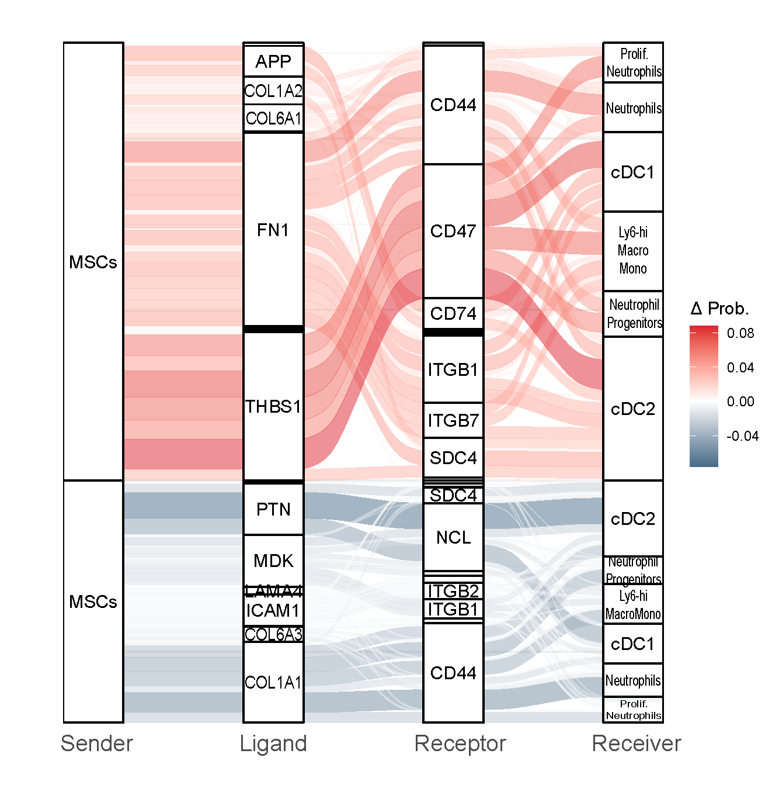

# SankeyPlot for CellChat
Generate Sankey plots from merged CellChat objects

After running CellChat and having a merged cellchat object, you might want to plot those relevant LR-pair interactions between cell types (groups).
Here is the function to do so.

## R version requirement

- R \>= 4.1.0

Packages you need

``` r
library(dplyr)
library(ggplot2)
library(tidyr)
library(ggalluvial)
library(reshape2)
```

#### Define the parameters
Between which cell types do you need your sankey plot?
Below is an example 

``` r
senders <- c("MSCs")
receivers <- list(
  c("Arterial EC", "Sinusoidal EC", "Specialized EC"),
  c("MSCs", "Epithelium")
)
```
And the experimental conditions contained in your merged CellChat object.
Here I also subset based on probability of interaction (0.0001) and pvalue < 0.05.

``` r
conditions <- list(
  list(cellchatcomp@net$control, cellchatcomp@net$condition, 0.0001, 0.05)
)
```

#### Function to process the data and generate the Sankey plot(s)

``` r
generate_sankey_plot <- function(cellchat_control, cellchat_condition, prob_threshold, pval_threshold, senders, receivers) {
  # Melt and filter data for WT
  prob_data_wt <- melt(cellchat_control$prob, value.name = "Prob", varnames = c("Sender(source)", "Receiver(target)", "LR pair"))
  pval_data_wt <- melt(cellchat_control$pval, value.name = "pval", varnames = c("Sender(source)", "Receiver(target)", "LR pair"))
  combined_data_wt <- merge(prob_data_wt, pval_data_wt, by = c("Sender(source)", "Receiver(target)", "LR pair"))
  filtered_data_wt <- combined_data_wt[combined_data_wt$Prob >= prob_threshold & combined_data_wt$pval <= pval_threshold, ]
  
  # Melt and filter data for JAK2VF
  prob_data_cond <- melt(cellchat_condition$prob, value.name = "Prob", varnames = c("Sender(source)", "Receiver(target)", "LR pair"))
  pval_data_cond <- melt(cellchat_condition$pval, value.name = "pval", varnames = c("Sender(source)", "Receiver(target)", "LR pair"))
  combined_data_cond <- merge(prob_data_cond, pval_data_cond, by = c("Sender(source)", "Receiver(target)", "LR pair"))
  filtered_data_cond <- combined_data_cond[combined_data_cond$Prob >= prob_threshold & combined_data_cond$pval <= pval_threshold, ]
  
  # Subset by senders and receivers
  filtered_data_wt <- filtered_data_wt %>%
    filter(`Sender(source)` %in% senders & `Receiver(target)` %in% receivers)
  filtered_data_cond <- filtered_data_cond
    filter(`Sender(source)` %in% senders & `Receiver(target)` %in% receivers)
  
  # Identify shared LR pairs
  shared_lr_pairs <- intersect(filtered_data_wt$`LR pair`, filtered_data_cond`LR pair`)
  
  # Subset for shared LR pairs
  shared_data_wt <- subset(filtered_data_wt, `LR pair` %in% shared_lr_pairs)
  shared_data_cond <- subset(filtered_data_cond, `LR pair` %in% shared_lr_pairs)
  
  # Merge and calculate difference
  merged_data <- merge(shared_data_wt, shared_data_cond, by = c("Sender(source)", "Receiver(target)", "LR pair"), suffixes = c("_wt", "_cond"))
  merged_data$diff_Prob <- merged_data$Prob_cond - merged_data$Prob_wt
  
  # Split LR pair into Ligand and Receptor
  merged_data <- merged_data %>%
    mutate(Ligand = sub("_.*", "", `LR pair`),
           Receptor = sub(".*_", "", `LR pair`))
  
  # Generate plot
  sankey_plot <- ggplot(data = merged_data,
                        aes(axis1 = `Sender(source)`, axis2 = Ligand, axis3 = Receptor, axis4 = `Receiver(target)`,
                            y = diff_Prob)) +
    scale_x_discrete(limits = c("Sender", "Ligand", "Receptor", "Receiver"), expand = c(.01, .05)) +
    xlab("") +
    geom_alluvium(aes(fill = diff_Prob)) +
    geom_stratum() +
    geom_text(stat = "stratum", aes(label = after_stat(stratum))) +
    scale_fill_gradient2(low = "#2b5876", mid = "white", high = "#dc2430", midpoint = 0, name = "Δ Prob.") +
    theme_minimal()
  
  return(sankey_plot)
}
```

#### Generate and save plots

```r
plots <- list()
for (cond in conditions) {
  for (receiver_set in receivers) {
    plot <- generate_sankey_plot(cond[[1]], cond[[2]], cond[[3]], cond[[4]], senders, receiver_set)
    plots[[paste(receiver_set, collapse = ",")]] <- plot
  }
}

# Display or save the plots
for (name in names(plots)) {
  print(plots[[name]])
}
```

Sankey plot between MSCs and the epithelium and MSCs. Red is upregulated and blue is downregulated

